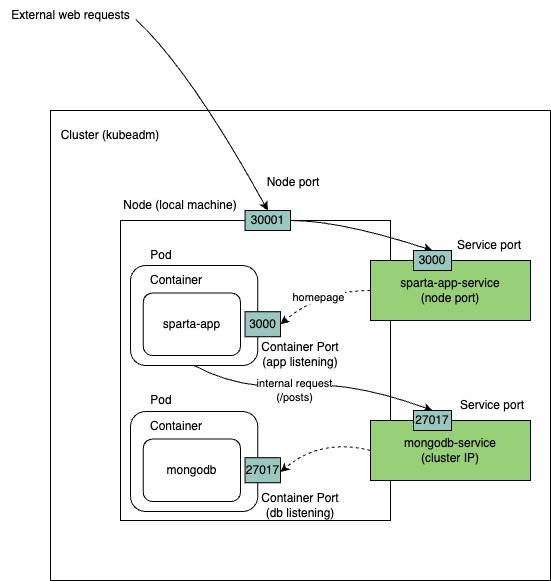
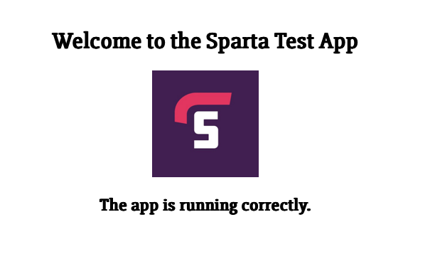

# Kubernetes Overview

## Why is Kubernetes Needed?

Kubernetes is an open-source container orchestration platform designed to automate the deployment, scaling, and management of containerized applications. It is needed because:

- **Container Management Complexity**: Managing large numbers of containers manually is challenging.
- **Scalability**: Kubernetes ensures applications can scale up and down efficiently based on demand.
- **High Availability**: It enables fault tolerance and self-healing mechanisms.
- **Resource Optimization**: Efficiently allocates resources, reducing operational costs.
- **Multi-Cloud Portability**: Works across different cloud providers and on-premises infrastructure.

## Benefits of Kubernetes

- **Automated Scaling**: Dynamically scales applications based on traffic and resource usage.
- **Load Balancing**: Distributes incoming traffic evenly across available resources.
- **Self-Healing**: Restarts failed containers, replaces and reschedules pods when necessary.
- **Efficient Resource Utilization**: Optimizes resource allocation and improves cost efficiency.
- **Service Discovery and Networking**: Provides built-in DNS-based service discovery.
- **Declarative Configuration**: Uses YAML or JSON files to define application infrastructure.
- **Rolling Updates and Rollbacks**: Ensures zero-downtime deployments with version control.
- **Security and Compliance**: Offers role-based access control (RBAC) and integration with security policies.

## Success Stories

1. **Spotify**: Uses Kubernetes to scale its microservices and manage workloads efficiently.
2. **Pinterest**: Migrated from a monolithic architecture to Kubernetes for improved performance and scalability.
3. **Airbnb**: Leverages Kubernetes to manage its infrastructure and support rapid deployment.
4. **Netflix**: Uses Kubernetes to automate deployments and ensure high availability.
5. **Reddit**: Adopted Kubernetes to handle high-traffic workloads dynamically.

## Kubernetes Architecture

Kubernetes follows a master-worker architecture:

### Cluster Architecture


## The Cluster Setup

### What is a Cluster?

A **Kubernetes cluster** is a set of nodes that run containerized applications. It consists of:

- **Master Node**: Manages the cluster, schedules workloads, and maintains the desired state.
- **Worker Nodes**: Execute workloads as instructed by the master node.

### Master vs Worker Nodes

- **Master Node**:
  - Runs the control plane components.
  - Manages cluster state and scheduling.
- **Worker Nodes**:
  - Execute the workloads.
  - Contain the container runtime and Kubelet agent.

### Managed Service vs Self-Hosted Kubernetes

- **Managed Service (e.g., AWS EKS, Google GKE, Azure AKS)**:
  - **Pros**: Reduced operational overhead, automatic updates, built-in security features.
  - **Cons**: Less control, vendor lock-in, additional cost.
- **Self-Hosted Kubernetes**:
  - **Pros**: Greater control, customizable configurations.
  - **Cons**: Requires more maintenance, manual upgrades and security patching.

### Control Plane vs Data Plane

- **Control Plane**: Manages the cluster, handles scheduling, and maintains desired state.
- **Data Plane**: Runs workloads and executes the instructions from the control plane.

## Kubernetes Objects

### Common Kubernetes Objects

- **Pods**: Smallest deployable unit containing one or more containers.
- **Deployments**: Manages replica sets and pod lifecycles.
- **ReplicaSets**: Ensures a specified number of pod replicas are running.
- **Services**: Provides network access to a set of pods.
- **ConfigMaps & Secrets**: Stores configuration data and sensitive information securely.

### What Does it Mean That a Pod is "Ephemeral"?

Pods are considered **ephemeral** because:

- They are temporary and can be recreated anytime.
- If a pod crashes or is deleted, Kubernetes replaces it.
- Data within a pod is lost unless persisted using persistent volumes.

## How to Mitigate Security Concerns with Containers

- **Use Minimal Base Images**: Reduce attack surface.
- **Implement Role-Based Access Control (RBAC)**: Restrict user permissions.
- **Enable Network Policies**: Restrict pod communication.
- **Scan Images for Vulnerabilities**: Use tools like Trivy or Clair.
- **Sign and Verify Images**: Ensure authenticity.
- **Apply the Principle of Least Privilege**: Avoid running containers as root.
- **Enable Audit Logging**: Monitor cluster activities.

## Maintained Images

### What Are Maintained Images?

Maintained images are container images that are actively updated, patched, and maintained by the community or vendors (e.g., official Docker Hub images).

### Pros and Cons of Using Maintained Images

- **Pros**:
  - Regular security updates and patches.
  - Community support and best practices.
  - Compatibility with popular frameworks.
- **Cons**:
  - Limited customization options.
  - Potential breaking changes in updates.
  - Dependency on third-party maintainers.

## Tasks

### Get kubernetes running on your local machine

- can use Docker Desktop (kubeadm) or minikube (single node kubernetes cluster used for testing on your local machine)
- have chosen minikube deployment, need to [install](https://minikube.sigs.k8s.io/docs/start/?arch=%2Flinux%2Fx86-64%2Fstable%2Fbinary+download) first.
- Start cluster post install:

```bash
minikube start
```

- should auto pickup your docker driver and pull the latest compatible kubernetes image.

- can interact with this running cluster the same as any kubernetes cluster e.g. get pods across all namespaces:

```bash
kubectl get pods -A
```

- should show you all pods including system pods e.g. etcd, ccm etc.

### Create Nginx pod

- create yaml file: `nginx-pod.yml`

```yml
apiVersion: v1
kind: Pod
metadata:
  name: nginx-pod
  labels:
    app: nginx
spec:
  containers:
    - name: nginx
      image: nginx:latest
      ports:
        - containerPort: 80
```

- `apiVersion: v1`. specifies the kubernetes API version to use for creating this object. v1 is the core API group and is used for fundamental objects like pods, services and namespaces. The `apiVersion` field is essential for the `kube-apiserver` to understand how to process the object defined in the manifest.
- `spec` describes the desired state of the pod.
  - `containers`: a list of containers to be run within the pod. In this case, we only have one container.
  - `ports`: list of ports this container will expose.
    - `containerPort: 80`: this container will expose port 80, standard HTTP port.

- apply the configuration:

```bash
kubectl apply -f nginx-pod.yml
```

- verify the pod is created and running:

```bash
kubectl get pods
```

- can also use describe for more detail:

```bash
kubectl describe pod nginx-pod
```

- check pod is READY and Running.

### Create Nginx deployment

- create yaml file: `nginx-deploy.yml`

```yml
apiVersion: apps/v1
kind: Deployment
metadata:
  name: nginx-deployment
  labels:
    app: nginx
spec:
  replicas: 3
  selector:
    matchLabels:
      app: nginx
  template:
    metadata:
      labels:
        app: nginx
    spec:
      containers:
        - name: nginx
          image: daraymonsta/nginx-257:dreamteam
          ports:
            - containerPort: 80
```

- note, deployment object manages the pods. In our case, we have 3 replica pods, each running one container based on the DockerHub image specified.
- `apiVersion: apps/v1`. For Deployments, you use the `apps/v1` API version, which is part of the `apps` API group and handles higher-level application management resources.
- `selector` label needs to match `template` label in order for the deployment to manage the pods with label `app: nginx`.
- `spec.template` defines the pod specification that the Deployment will use to create new pods. And `spec.template.spec` specifies the desired state of the pod e.g. the containers it should run.

- apply the configuration:

```bash
kubectl apply -f nginx-deploy.yml
```

- this will create the kubernetes deployment object.
- can inspect the deployment, replicasets, pods or all with single command e.g.

```bash
kubectl get all
```

- should show `ready` status.
- since we do not have a service exposing the deployment from outside the cluster, we need to use port-forwarding to our deployment in order to access the nginx instance:

```bash
kubectl port-forward deployment/nginx-deployment 8080:80
```

- note, port-forwarding is primarily for testing and debugging rather than production use.
- can access the app now via `localhost:8080`.

- also note, `kubectl proxy` is an alternative method which can yield similar results to `kubectl port-forwarding` but it is geared towards API access. For accessing web apps, `kubectl port forwarding` is recommended and is simpler (direct access to the web app, no need to worry about API requests).

### Get a NodePort service running

- create yml file: `nginx-service.yml`

```yml
apiVersion: v1
kind: Service
metadata:
  name: nginx-svc
spec:
  type: NodePort
  selector:
    app: nginx
  ports:
  - port: 80
    targetPort: 80
    nodePort: 30001
```

- apply the configuration:

```bash
kubectl apply -f nginx-service.yml
```

- confirm both the deployment and the service are running.

- **BLOCKER**:

- I expected that after configuring this service, which exposed port 30001 on the node, I would be able to access the nginx app via localhost:30001. But this didn't work.

- **RESOLVE**:

- The reason for the above is that minikube with docker driver, which I have been using so far for testing, runs the kubernetes cluster inside a docker container with its own IP (minikube IP). So in other words, if I `minikube ssh` into the container, I can run `curl localhost:30001` to get the contents of the amended nginx page. But this wouldn't work on my local machine outside the minikube container.
- To access it from my local machine, I can use minikube's built in service URL. shown by running: `minikube service nginx-svc --url`. This works because minikube forwards the service to a random localhost port e.g. `http://127.0.0.1:5217`, essentially running a `kubectl port-forward` session in the background. This new url will work and the app will load.
- For simplicity, moving forward, I am now using docker desktop's `kubeadm` which runs kubernetes directly on my local machine (not inside a container). Enabling this in docker desktop, checking cluster status, changing kubectl context and recreating the services - the page now loads up via `localhost:30001`.


### See what happens when we delete a pod

- show all pods: `kubectl get pods`


- delete one pod: `kubectl delete pod nginx-deployment-68d98fd8fc-l649w`

- view pods again: `kubectl get pods`


- notice the first pod has been replaced (new pod name and age). This is one of the benefits of using a Deployment controller to manage your pods!

- `kubectl describe pod nginx-deployment-68d98fd8fc-ltsfn`:


- see events timeline for new pod

### Increase replicas with no downtime

- want to be able to increase the number of replicas (pods) in our deployment in real-time, without needing to destroy and re-create our deployment.
- few ways to do this...

#### Method 1: Edit the deployment file in real-time

```bash
KUBE_EDITOR="nano" kubectl edit deployment nginx-deployment
```

- will open up the deployment's yml config in nano.
- need to change the replica count e.g. 4. Save and exit.
- verify the change:

```bash
kubectl get deployment nginx-deployment
```

- should see 4/4 pods READY.


#### Method 2: Apply a modified deployment file

- edit the nginx-deployment.yml file.
- change replicas to e.g. 5.
- apply the updated deployment:

```bash
kubectl apply -f nginx-deploy.yml
```

- verify the change.

```bash
kubectl get deployment nginx-deployment
```


#### Method 3: Use the scale command

- use one-liner scale command:

```bash
kubectl scale deployment nginx-deployment --replicas=6
```

- verify the change.

```bash
kubectl get deployment nginx-deployment
```


- each of these methods are examples of `manual scaling` in real-time i.e. we didn't delete and re-create the deployment so no downtime.
- Can also setup autoscaling in kubernetes.

### Delete K8s deployments and services

```bash
kubectl delete deployment nginx-deployment
```

```bash
kubectl delete service nginx-svc
```

- these commands will delete the deployment and service we created.

### K8s deployment of NodeJS Sparta test app

- use existing Docker image for sparta-test-app
- use maintained docker image for Mongo



- `app-deploy.yml`:

```yml
apiVersion: apps/v1
kind: Deployment
metadata:
  name: sparta-app-deployment
  labels:
    app: sparta-app
spec:
  replicas: 3
  selector:
    matchLabels:
      app: sparta-app
  template:
    metadata:
      labels:
        app: sparta-app
    spec:
      containers:
        - name: sparta-app
          image: sameem97/sparta-test-app:latest
          ports:
            - containerPort: 3000
          env:
            - name: DB_HOST
              value: "mongodb://mongodb-service:27017/posts"

---
apiVersion: v1
kind: Service
metadata:
  name: sparta-app-service
spec:
  type: NodePort
  selector:
    app: sparta-app
  ports:
  - port: 3000
    targetPort: 3000
    nodePort: 30001
```

- `db-deploy.yml`:

```yml
# mongodb-deploy.yml
apiVersion: apps/v1
kind: Deployment
metadata:
  name: mongodb-deployment
  labels:
    app: mongodb
spec:
  replicas: 1
  selector:
    matchLabels:
      app: mongodb
  template:
    metadata:
      labels:
        app: mongodb
    spec:
      containers:
        - name: mongodb
          image: mongo:latest
          ports:
            - containerPort: 27017

---
apiVersion: v1
kind: Service
metadata:
  name: mongodb-service
spec:
  selector:
    app: mongodb
  ports:
    - port: 27017
      targetPort: 27017
  type: ClusterIP
```

- `localhost:30001`:



- `localhost:30001/posts`:


- note, the setup above requires `db-deploy.yml` to be up and running first before `app-deploy.yml` is applied. Otherwise due to the connection string referencing the `mongodb-service`, the app fails to connect and crashes. Kubernetes restart policy default (Always) causes a restart loop.

### Create 2-tier deployment with PV for database

- currently mongodb uses container filesystem for storage
- pods are ephemeral in kuberentes by default so if the mongodb pod restarts or is rescheduled, the data would be lost, which is not acceptable of course.
- to solve this, we can use Persistant Volumes (PV) and Persistent Volume Claims (PVC).


- PV represents a storage volume in a cluster, provisioned by a cluster admin.
- they are similar to physical storage devices found on the host machine
- they exist independently of any pod's lifecycle
- when bound to a pod, they function similarly to regular volumes, offering a reliable means of data storage.
- PVC is the user's `claim` for the platform to create a PV on their behalf. If a suitable PV exists already, then the cluster will `bind` the PVC to the PV.
- PV can be backed by local disk or cloud storage, NFS etc. In our case, we will use the local host filesystem for simplicity, `hostPath`.

- `db-pv.yml`:

```yml
apiVersion: v1
kind: PersistentVolume
metadata:
  name: mongodb-pv
spec:
  capacity:
    storage: 100Mi # provision 100mb
  accessModes:
    - ReadWriteOnce # The volume can be mounted as read-write by a single node (my local machine)
  hostPath:
    path: "/data/mongodb"  # Local host storage path where the data will be stored
  persistentVolumeReclaimPolicy: Retain

```

- `db-pvc.yml`:

```yml
apiVersion: v1
kind: PersistentVolumeClaim
metadata:
  name: mongodb-pvc
spec:
  accessModes:
    - ReadWriteOnce
  resources:
    requests:
      storage: 100Mi
```

- modify `db-deploy.yml` to use PV:

```yml
apiVersion: apps/v1
kind: Deployment
metadata:
  name: mongodb-deployment
  labels:
    app: mongodb
spec:
  replicas: 1
  selector:
    matchLabels:
      app: mongodb
  template:
    metadata:
      labels:
        app: mongodb
    spec:
      containers:
        - name: mongodb
          image: mongo:latest
          ports:
            - containerPort: 27017
          volumeMounts:
            - name: mongodb-persistent-storage
              mountPath: /data/db
      volumes:
        - name: mongodb-persistent-storage
          persistentVolumeClaim:
            claimName: mongodb-pvc # This is the name of the PVC that we created earlier

---
apiVersion: v1
kind: Service
metadata:
  name: mongodb-service
spec:
  selector:
    app: mongodb
  ports:
    - port: 27017
      targetPort: 27017
  type: ClusterIP
```

- can see above in `db-deploy.yml` we have defined a volume called `mongodb-persistent-storage` which is referencing the PVC `mongodb-pvc` that we created earlier.

- once we have created the resources in the order: pv -> pvc -> mongodb -> app, confirm the app and /posts page is running.
- to test our PV is working properly, delete and re-create the mongodb deployment. The /posts page should show the same posts as before.

