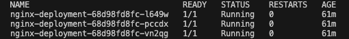

# Kubernetes Overview

- [Kubernetes Overview](#kubernetes-overview)
  - [Why is Kubernetes Needed?](#why-is-kubernetes-needed)
  - [Benefits of Kubernetes](#benefits-of-kubernetes)
  - [Success Stories](#success-stories)
  - [Kubernetes Architecture](#kubernetes-architecture)
    - [Cluster Architecture](#cluster-architecture)
  - [The Cluster Setup](#the-cluster-setup)
    - [What is a Cluster?](#what-is-a-cluster)
    - [Master vs Worker Nodes](#master-vs-worker-nodes)
    - [Managed Service vs Self-Hosted Kubernetes](#managed-service-vs-self-hosted-kubernetes)
    - [Control Plane vs Data Plane](#control-plane-vs-data-plane)
  - [Kubernetes Objects](#kubernetes-objects)
    - [Common Kubernetes Objects](#common-kubernetes-objects)
    - [What Does it Mean That a Pod is "Ephemeral"?](#what-does-it-mean-that-a-pod-is-ephemeral)
  - [How to Mitigate Security Concerns with Containers](#how-to-mitigate-security-concerns-with-containers)
  - [Maintained Images](#maintained-images)
    - [What Are Maintained Images?](#what-are-maintained-images)
    - [Pros and Cons of Using Maintained Images](#pros-and-cons-of-using-maintained-images)
  - [Tasks](#tasks)
    - [Get kubernetes running on your local machine](#get-kubernetes-running-on-your-local-machine)
    - [Create Nginx pod](#create-nginx-pod)
    - [Create Nginx deployment](#create-nginx-deployment)
    - [Get a NodePort service running](#get-a-nodeport-service-running)
    - [See what happens when we delete a pod](#see-what-happens-when-we-delete-a-pod)
    - [Increase replicas with no downtime](#increase-replicas-with-no-downtime)
      - [Method 1: Edit the deployment file in real-time](#method-1-edit-the-deployment-file-in-real-time)
      - [Method 2: Apply a modified deployment file](#method-2-apply-a-modified-deployment-file)
      - [Method 3: Use the scale command](#method-3-use-the-scale-command)
    - [Delete K8s deployments and services](#delete-k8s-deployments-and-services)
    - [K8s deployment of NodeJS Sparta test app](#k8s-deployment-of-nodejs-sparta-test-app)
    - [Create 2-tier deployment with PV for database](#create-2-tier-deployment-with-pv-for-database)
      - [Verify data persistence](#verify-data-persistence)
    - [Extention: Remove PVC/PV and retain data](#extention-remove-pvcpv-and-retain-data)
    - [Setup Minikube on cloud instance running ubuntu 22.04 LTS](#setup-minikube-on-cloud-instance-running-ubuntu-2204-lts)
    - [Deploy three apps on single cloud instance running Minikube](#deploy-three-apps-on-single-cloud-instance-running-minikube)
      - [First app deployment](#first-app-deployment)
      - [Second app deployment](#second-app-deployment)
      - [Third app deployment](#third-app-deployment)
    - [Use Kubernetes to deploy the Sparta test app in the cloud](#use-kubernetes-to-deploy-the-sparta-test-app-in-the-cloud)
  - [What I learnt](#what-i-learnt)
  - [Benefits I saw from this project](#benefits-i-saw-from-this-project)

## Why is Kubernetes Needed?

Kubernetes is an open-source container orchestration platform designed to automate the deployment, scaling, and management of containerized applications. It is needed because:

- **Container Management Complexity**: Managing large numbers of containers manually is challenging.
- **Scalability**: Kubernetes ensures applications can scale up and down efficiently based on demand.
- **High Availability**: It enables fault tolerance and self-healing mechanisms.
- **Resource Optimization**: Efficiently allocates resources, reducing operational costs.
- **Multi-Cloud Portability**: Works across different cloud providers and on-premises infrastructure.

## Benefits of Kubernetes

- **Automated Scaling**: Dynamically scales applications based on traffic and resource usage.
- **Load Balancing**: Distributes incoming traffic evenly across available resources.
- **Self-Healing**: Restarts failed containers, replaces and reschedules pods when necessary.
- **Efficient Resource Utilization**: Optimizes resource allocation and improves cost efficiency.
- **Service Discovery and Networking**: Provides built-in DNS-based service discovery.
- **Declarative Configuration**: Uses YAML or JSON files to define application infrastructure.
- **Rolling Updates and Rollbacks**: Ensures zero-downtime deployments with version control.
- **Security and Compliance**: Offers role-based access control (RBAC) and integration with security policies.

## Success Stories

1. **Spotify**: Uses Kubernetes to scale its microservices and manage workloads efficiently.
2. **Pinterest**: Migrated from a monolithic architecture to Kubernetes for improved performance and scalability.
3. **Airbnb**: Leverages Kubernetes to manage its infrastructure and support rapid deployment.
4. **Netflix**: Uses Kubernetes to automate deployments and ensure high availability.
5. **Reddit**: Adopted Kubernetes to handle high-traffic workloads dynamically.

## Kubernetes Architecture

Kubernetes follows a master-worker architecture:

### Cluster Architecture


## The Cluster Setup

### What is a Cluster?

A **Kubernetes cluster** is a set of nodes that run containerized applications. It consists of:

- **Master Node**: Manages the cluster, schedules workloads, and maintains the desired state.
- **Worker Nodes**: Execute workloads as instructed by the master node.

### Master vs Worker Nodes

- **Master Node**:
  - Runs the control plane components.
  - Manages cluster state and scheduling.
- **Worker Nodes**:
  - Execute the workloads.
  - Contain the container runtime and Kubelet agent.

### Managed Service vs Self-Hosted Kubernetes

- **Managed Service (e.g., AWS EKS, Google GKE, Azure AKS)**:
  - **Pros**: Reduced operational overhead, automatic updates, built-in security features.
  - **Cons**: Less control, vendor lock-in, additional cost.
- **Self-Hosted Kubernetes**:
  - **Pros**: Greater control, customizable configurations.
  - **Cons**: Requires more maintenance, manual upgrades and security patching.

### Control Plane vs Data Plane

- **Control Plane**: Manages the cluster, handles scheduling, and maintains desired state.
- **Data Plane**: Runs workloads and executes the instructions from the control plane.

## Kubernetes Objects

### Common Kubernetes Objects

- **Pods**: Smallest deployable unit containing one or more containers.
- **Deployments**: Manages replica sets and pod lifecycles.
- **ReplicaSets**: Ensures a specified number of pod replicas are running.
- **Services**: Provides network access to a set of pods.
- **ConfigMaps & Secrets**: Stores configuration data and sensitive information securely.

### What Does it Mean That a Pod is "Ephemeral"?

Pods are considered **ephemeral** because:

- They are temporary and can be recreated anytime.
- If a pod crashes or is deleted, Kubernetes replaces it.
- Data within a pod is lost unless persisted using persistent volumes.

## How to Mitigate Security Concerns with Containers

- **Use Minimal Base Images**: Reduce attack surface.
- **Implement Role-Based Access Control (RBAC)**: Restrict user permissions.
- **Enable Network Policies**: Restrict pod communication.
- **Scan Images for Vulnerabilities**: Use tools like Trivy or Clair.
- **Sign and Verify Images**: Ensure authenticity.
- **Apply the Principle of Least Privilege**: Avoid running containers as root.
- **Enable Audit Logging**: Monitor cluster activities.

## Maintained Images

### What Are Maintained Images?

Maintained images are container images that are actively updated, patched, and maintained by the community or vendors (e.g., official Docker Hub images).

### Pros and Cons of Using Maintained Images

- **Pros**:
  - Regular security updates and patches.
  - Community support and best practices.
  - Compatibility with popular frameworks.
- **Cons**:
  - Limited customization options.
  - Potential breaking changes in updates.
  - Dependency on third-party maintainers.

## Tasks

### Get kubernetes running on your local machine

- can use Docker Desktop (kubeadm) or minikube (single node kubernetes cluster used for testing on your local machine)
- have chosen minikube deployment, need to [install](https://minikube.sigs.k8s.io/docs/start/?arch=%2Flinux%2Fx86-64%2Fstable%2Fbinary+download) first.
- Start cluster post install:

```bash
minikube start
```

- should auto pickup your docker driver and pull the latest compatible kubernetes image.

- can interact with this running cluster the same as any kubernetes cluster e.g. get pods across all namespaces:

```bash
kubectl get pods -A
```

- should show you all pods including system pods e.g. etcd, ccm etc.

### Create Nginx pod

- create yaml file: `nginx-pod.yml`

```yml
apiVersion: v1
kind: Pod
metadata:
  name: nginx-pod
  labels:
    app: nginx
spec:
  containers:
    - name: nginx
      image: nginx:latest
      ports:
        - containerPort: 80
```

- `apiVersion: v1`. specifies the kubernetes API version to use for creating this object. v1 is the core API group and is used for fundamental objects like pods, services and namespaces. The `apiVersion` field is essential for the `kube-apiserver` to understand how to process the object defined in the manifest.
- `spec` describes the desired state of the pod.
  - `containers`: a list of containers to be run within the pod. In this case, we only have one container.
  - `ports`: list of ports this container will expose.
    - `containerPort: 80`: this container will expose port 80, standard HTTP port.

- apply the configuration:

```bash
kubectl apply -f nginx-pod.yml
```

- verify the pod is created and running:

```bash
kubectl get pods
```

- can also use describe for more detail:

```bash
kubectl describe pod nginx-pod
```

- check pod is READY and Running.

### Create Nginx deployment

- create yaml file: `nginx-deploy.yml`

```yml
apiVersion: apps/v1
kind: Deployment
metadata:
  name: nginx-deployment
  labels:
    app: nginx
spec:
  replicas: 3
  selector:
    matchLabels:
      app: nginx
  template:
    metadata:
      labels:
        app: nginx
    spec:
      containers:
        - name: nginx
          image: daraymonsta/nginx-257:dreamteam
          ports:
            - containerPort: 80
```

- note, deployment object manages the pods. In our case, we have 3 replica pods, each running one container based on the DockerHub image specified.
- `apiVersion: apps/v1`. For Deployments, you use the `apps/v1` API version, which is part of the `apps` API group and handles higher-level application management resources.
- `selector` label needs to match `template` label in order for the deployment to manage the pods with label `app: nginx`.
- `spec.template` defines the pod specification that the Deployment will use to create new pods. And `spec.template.spec` specifies the desired state of the pod e.g. the containers it should run.

- apply the configuration:

```bash
kubectl apply -f nginx-deploy.yml
```

- this will create the kubernetes deployment object.
- can inspect the deployment, replicasets, pods or all with single command e.g.

```bash
kubectl get all
```

- should show `ready` status.
- since we do not have a service exposing the deployment from outside the cluster, we need to use port-forwarding to our deployment in order to access the nginx instance:

```bash
kubectl port-forward deployment/nginx-deployment 8080:80
```

- note, port-forwarding is primarily for testing and debugging rather than production use.
- can access the app now via `localhost:8080`.

- also note, `kubectl proxy` is an alternative method which can yield similar results to `kubectl port-forwarding` but it is geared towards API access. For accessing web apps, `kubectl port forwarding` is recommended and is simpler (direct access to the web app, no need to worry about API requests).

### Get a NodePort service running

- create yml file: `nginx-service.yml`

```yml
apiVersion: v1
kind: Service
metadata:
  name: nginx-svc
spec:
  type: NodePort
  selector:
    app: nginx
  ports:
  - port: 80
    targetPort: 80
    nodePort: 30001
```

- apply the configuration:

```bash
kubectl apply -f nginx-service.yml
```

- confirm both the deployment and the service are running.

- **BLOCKER**:

- I expected that after configuring this service, which exposed port 30001 on the node, I would be able to access the nginx app via localhost:30001. But this didn't work.

- **RESOLVE**:

- The reason for the above is that minikube with docker driver, which I have been using so far for testing, runs the kubernetes cluster inside a docker container with its own IP (minikube IP). So in other words, if I `minikube ssh` into the container, I can run `curl localhost:30001` to get the contents of the amended nginx page. But this wouldn't work on my local machine outside the minikube container.
- To access it from my local machine, I can use minikube's built in service URL. shown by running: `minikube service nginx-svc --url`. This works because minikube forwards the service to a random localhost port e.g. `http://127.0.0.1:5217`, essentially running a `kubectl port-forward` session in the background. This new url will work and the app will load.
- For simplicity, moving forward, I am now using docker desktop's `kubeadm` which runs kubernetes in a (HyperKit) VM on my local machine. Enabling this in docker desktop, checking cluster status, changing kubectl context and recreating the services - the page now loads up via `localhost:30001`.


### See what happens when we delete a pod

- show all pods: `kubectl get pods`



- delete one pod: `kubectl delete pod nginx-deployment-68d98fd8fc-l649w`

- view pods again: `kubectl get pods`


- notice the first pod has been replaced (new pod name and age). This is one of the benefits of using a Deployment controller to manage your pods!

- `kubectl describe pod nginx-deployment-68d98fd8fc-ltsfn`:


- see events timeline for new pod

### Increase replicas with no downtime

- want to be able to increase the number of replicas (pods) in our deployment in real-time, without needing to destroy and re-create our deployment.
- few ways to do this...

#### Method 1: Edit the deployment file in real-time

```bash
KUBE_EDITOR="nano" kubectl edit deployment nginx-deployment
```

- will open up the deployment's yml config in nano.
- need to change the replica count e.g. 4. Save and exit.
- verify the change:

```bash
kubectl get deployment nginx-deployment
```

- should see 4/4 pods READY.


#### Method 2: Apply a modified deployment file

- edit the nginx-deployment.yml file.
- change replicas to e.g. 5.
- apply the updated deployment:

```bash
kubectl apply -f nginx-deploy.yml
```

- verify the change.

```bash
kubectl get deployment nginx-deployment
```


#### Method 3: Use the scale command

- use one-liner scale command:

```bash
kubectl scale deployment nginx-deployment --replicas=6
```

- verify the change.

```bash
kubectl get deployment nginx-deployment
```


- each of these methods are examples of `manual scaling` in real-time i.e. we didn't delete and re-create the deployment so no downtime.
- Can also setup autoscaling in kubernetes.

### Delete K8s deployments and services

```bash
kubectl delete deployment nginx-deployment
```

```bash
kubectl delete service nginx-svc
```

- these commands will delete the deployment and service we created.

### K8s deployment of NodeJS Sparta test app

- use existing Docker image for sparta-test-app
- use maintained docker image for Mongo


- `app-deploy.yml`:

```yml
apiVersion: apps/v1
kind: Deployment
metadata:
  name: sparta-app-deployment
  labels:
    app: sparta-app
spec:
  replicas: 3
  selector:
    matchLabels:
      app: sparta-app
  template:
    metadata:
      labels:
        app: sparta-app
    spec:
      containers:
        - name: sparta-app
          image: sameem97/sparta-test-app:latest
          ports:
            - containerPort: 3000
          env:
            - name: DB_HOST
              value: "mongodb://mongodb-service:27017/posts"

---
apiVersion: v1
kind: Service
metadata:
  name: sparta-app-service
spec:
  type: NodePort
  selector:
    app: sparta-app
  ports:
  - port: 3000
    targetPort: 3000
    nodePort: 30001
```

- `db-deploy.yml`:

```yml
# mongodb-deploy.yml
apiVersion: apps/v1
kind: Deployment
metadata:
  name: mongodb-deployment
  labels:
    app: mongodb
spec:
  replicas: 1
  selector:
    matchLabels:
      app: mongodb
  template:
    metadata:
      labels:
        app: mongodb
    spec:
      containers:
        - name: mongodb
          image: mongo:7.0
          ports:
            - containerPort: 27017
          resources: # resource requests and limits
            requests:
              memory: "256Mi"
              cpu: "250m"
            limits:
              memory: "0.5Gi"
              cpu: "500m"

---
apiVersion: v1
kind: Service
metadata:
  name: mongodb-service
spec:
  selector:
    app: mongodb
  ports:
    - port: 27017
      targetPort: 27017
  type: ClusterIP
```

- `localhost:30001`:


- `localhost:30001/posts`:


- note, the setup above requires `db-deploy.yml` to be up and running first before `app-deploy.yml` is applied. Otherwise due to the connection string referencing the `mongodb-service`, the app fails to connect and crashes. Kubernetes restart policy default (Always) causes a restart loop.

### Create 2-tier deployment with PV for database

- currently mongodb uses container filesystem for storage
- pods are ephemeral in kubernetes by default so if the mongodb pod restarts or is rescheduled, the data would be lost, which is not acceptable of course.
- to solve this, we can use Persistant Volumes (PV) and Persistent Volume Claims (PVC).


- PV represents a storage volume in a cluster, provisioned by a cluster admin.
- they are similar to physical storage devices found on the host machine
- they exist independently of any pod's lifecycle
- when bound to a pod, they function similarly to regular volumes, offering a reliable means of data storage.
- PVC is the user's `claim` for the platform to create a PV on their behalf. If a suitable PV exists already, then the cluster will `bind` the PVC to the PV.
- PV can be backed by local disk or cloud storage, NFS etc. In our case, we will use the local host filesystem for simplicity, `hostPath`.

- `db-pv.yml`:

```yml
apiVersion: v1
kind: PersistentVolume
metadata:
  name: mongodb-pv
spec:
  capacity:
    storage: 100Mi # provision 100mb
  accessModes:
    - ReadWriteOnce # The volume can be mounted as read-write by a single node (my local machine)
  hostPath:
    path: "/var/lib/mongodb"  # Local host (Docker Desktop Kubernetes VM) storage path where the data will be stored
  persistentVolumeReclaimPolicy: Retain # keep PV data even after PVC is deleted
```

- `db-pvc.yml`:

```yml
apiVersion: v1
kind: PersistentVolumeClaim
metadata:
  name: mongodb-pvc
spec:
  accessModes:
    - ReadWriteOnce
  resources:
    requests:
      storage: 100Mi
  volumeName: mongodb-pv
  storageClassName: "" # This is an empty string because we are using the default storage class
```

- modify `db-deploy.yml` to use PV:

```yml
apiVersion: apps/v1
kind: Deployment
metadata:
  name: mongodb-deployment
  labels:
    app: mongodb
spec:
  replicas: 1
  selector:
    matchLabels:
      app: mongodb
  template:
    metadata:
      labels:
        app: mongodb
    spec:
      containers:
        - name: mongodb
          image: mongo:7.0
          ports:
            - containerPort: 27017
          volumeMounts:
            - name: mongodb-persistent-storage
              mountPath: /data/db # container path where the data will be stored
          resources: # resource requests and limits
            requests:
              memory: "256Mi"
              cpu: "250m"
            limits:
              memory: "0.5Gi"
              cpu: "500m"
      volumes:
        - name: mongodb-persistent-storage
          persistentVolumeClaim:
            claimName: mongodb-pvc # This is the name of the PVC that we created earlier

---
apiVersion: v1
kind: Service
metadata:
  name: mongodb-service
spec:
  selector:
    app: mongodb
  ports:
    - port: 27017
      targetPort: 27017
  type: ClusterIP
```

- can see above in `db-deploy.yml` we have defined a volume called `mongodb-persistent-storage` which is referencing the PVC `mongodb-pvc` that we created earlier.

- once we have created the resources in the order: pv -> pvc -> mongodb -> app, confirm the app and /posts page is running.

#### Verify data persistence

- since we are using hostPath volume which simply mounts an existing directory inside the Docker Kubernetes VM on our local machine to the container, to confirm persistence we can make a change on the container mountPath `/data/db` e.g. create test file, and see if this appears in our hostPath `/var/lib/mongodb` on the VM.
- use docker desktop to access mongodb container filesystem, create `test-file`.
- use `nsenter1` to access the VM's process namespace (different but similar to ssh for our purposes):

```bash
docker run --rm -it --privileged --pid=host justincormack/nsenter1
```

- confirm the `test-file` exists on the VM in `/var/lib/mongodb`.
- if so, then the mongodb data is persisting outside the container.
- so re-creating the container will mount the same hostPath on the VM so e.g. creating an extra post via mongosh (see below) for example will persist even when the container is re-created.

1. Connect to mongodb and add some test data:

```bash
kubectl exec -it <mongodb_pod> -- mongosh --eval 'db.posts.insert({title:"Test Post", body:"This is a test post to verify data persistence"})'
```

2. Delete the mongodb pod.

```bash
kctl delete pod <mongodb_pod>
```

- Wait for deployment to re-create the pod.
- When the new pod comes up, it will mount the same `/var/lib/mongodb` path.

3. Check if the data persisted.

- query for the test data:

```bash
kubectl exec -it <mongodb+pod> -- mongosh --eval 'db.posts.find().pretty()'
```

- this should show the data you inserted earlier.
- the reason is because that post persisted in the hostPath directory which is mounted in the container filesystem.

### Extention: Remove PVC/PV and retain data

- since we used hostPath volume, deleting PV and PVC will still retain the data in the hostPath directory on our Docker Kubernetes VM.
- so recreating the PV and PVC, the hostPath will simply be mounted by the container in the mountPath so the data will persist the same as previously.

### Setup Minikube on cloud instance running ubuntu 22.04 LTS

- AWS EC2 instance size t3a.small
- image ubuntu 22.04 LTS
- first install Docker, test by running `hello-world` image
- then install minikube, test with `minikube start`
- may need to grant $USER permission to access Docker daemon without using `sudo`
- lastly, need to install kubectl to interact with the minikube cluster
- check context is minikube: `kubectl config current-context`

### Deploy three apps on single cloud instance running Minikube

- aim: deploy three apps on minikube that will run at the same time and be exposed to the outside world at different endpoints.

#### First app deployment

- use NodePort service at NodePort 30001
- use image: `daraymonsta/nginx-257:dreamteam` with container port 80.
- app container should have 5 replicas.
- configure nginx reverse proxy so you can access the app externally via: `<ec2_public_ip>:80`

- `nginx-deploy.yml`:

```yml
apiVersion: apps/v1
kind: Deployment
metadata:
  name: nginx-deployment
  labels:
    app: nginx
spec:
  replicas: 5
  selector:
    matchLabels:
      app: nginx
  template:
    metadata:
      labels:
        app: nginx
    spec:
      containers:
        - name: nginx
          image: daraymonsta/nginx-257:dreamteam
          ports:
            - containerPort: 80

---
apiVersion: v1
kind: Service
metadata:
  name: nginx-service
spec:
  type: NodePort
  selector:
    app: nginx
  ports:
  - port: 80 # exposed service port
    targetPort: 80 # target container port
    nodePort: 30001 # exposed node port
```

- apply the config, confirm you can access nginx via:

```bash
curl <minikube_ip>:30001
```

- should show html contents of nginx page.
- since minikube is running in a docker container on the EC2, need to use nginx reverse proxy to forward requests from port 80 on the ec2 to the minikube ip port 30001.
- first install nginx on the ec2 instance.

```bash
sudo apt update && sudo apt install nginx -y
```

- note minikube ip and nodeport, will input this in nginx.conf file below:

```bash
sudo nano /etc/nginx/sites-available/default
```

- replace *try_files* line in *default server block* with: `proxy_pass http://<minikube_ip>:30001;`
- reload nginx: `sudo systemctl reload nginx`
- on your local machine can now access nginx via: `<ec2_public_ip>` i.e. default port 80. Nginx reverse proxy is forwarding the request to the minikube container, nodeport running our nginx app.


#### Second app deployment

- use loadbalancer service at port 9000
- use `minikube tunnel` to emulate loadbalancer on the ec2 instance.
- use image `daraymonsta/tech201-nginx-auto:v1` with container port 80.
  - app container should have two replicas
- use nginx reverse proxy on the ec2 to forward requests sent to `<ec2_public_ip>:9000` to minikube loadbalancer endpoint i.e. `<lb_external_ip>:9000`. The load balancer will then forward the requests to a given pod with the app container.
- app able to be accessed from outside the ec2 via `<ec2-public-ip>:9000`

---

- Question - Why do we need to use minikube tunnel?

- in typical cloud environments e.g. AWS, when you create loadbalancer service, the cloud provider (e.g. AWS ELB service) automatically provisions external IP and routes traffic to your kubernetes cluster.
- since minikube does not run on a real cloud, so:
  - It cannot request a real loadbalancer IP from a cloud provider.
  - By default, `kubectl get service` will show `<pending>` in the EXTERNAL-IP field for loadbalancer services.
  - Minikube Tunnel creates a local *loadbalancer simulation* by assigning an internal IP (e.g., 10.x.x.x) to the loadbalancer service, which is reachable **within** the ec2 instance specifying the load balancer exposed port.

  - e.g. without minikube tunnel:

```bash
`kubectl get service my-app-service`
```

```pgsql
NAME             TYPE           CLUSTER-IP       EXTERNAL-IP   PORT(S)        AGE
my-app-service   LoadBalancer   10.109.200.234   <pending>     9000:30002/TCP 10s
```

  - with minikube tunnel:

```bash
sudo minikube tunnel
kubectl get service my-app-service
```

```pgsql
NAME             TYPE           CLUSTER-IP       EXTERNAL-IP      PORT(S)        AGE
my-app-service   LoadBalancer   10.109.200.234   <10.x.x.x>        9000:30002/TCP 10s
```

- as visible, the external ip is `10.x.x.x` meaning minikube has created a proxy.
- so any traffic from **within** ec2 sent to <external_ip>:9000 i.e. minikube loadbalancer endpoint will be forwarded to a given pod with relevant label.
- so essentially, `minikube tunnel` allows the loadbalancer service to be reached from within the ec2. But to be able to access it from outside the ec2, we will need to use nginx reverse proxy.
- do also note, `10.x.x.x` IP is part of the private minikube network. This is the case for us because we are using minikube in a docker container. If we were using kubernetes in a VM or bare metal, the assigned external IP would be `127.0.0.1` i.e. ec2 localhost. But in our case, the assigned external IP is private because minikube network can't reach ec2 network stack.

---

- create `nginx-deploy-2.yml`:

```yml
apiVersion: apps/v1
kind: Deployment
metadata:
  name: nginx-deployment-2
  labels:
    app: nginx-tech201
spec:
  replicas: 2
  selector:
    matchLabels:
      app: nginx-tech201
  template:
    metadata:
      labels:
        app: nginx-tech201
    spec:
      containers:
        - name: nginx
          image: daraymonsta/tech201-nginx-auto:v1
          ports:
            - containerPort: 80

---
apiVersion: v1
kind: Service
metadata:
  name: nginx-lb-service
spec:
  type: LoadBalancer
  ports:
    - port: 9000      # External LoadBalancer Port
      targetPort: 80   # Container Port
      nodePort: 30002
  selector:
    app: nginx-tech201
```

- have defined loadbalancer service exposing port 9000 on loadbalancer (<lb_external_ip>:9000 endpoint via minikube tunnel) and container port 80 as exposed in the deployment.
- please note, `nodeport: 30002` is optional. Typically load balancer services won't utilise this but in minikube a loadbalancer is actually a wrapper around a nodeport and this nodeport is automatically assigned. In my case, I have explicitly chosen 30002.
- apply the deployment.
- check service:

```bash
kubectl get service nginx-lb-service
```

- `EXTERNAL IP` will show pending as expected.

- enable minikube tunnel in background:

```bash
sudo -E nohup minikube tunnel > tunnel.log 2>&1 &
```

- check service again:

```bash
kubectl get service nginx-lb-service
```

- should show `EXTERNAL IP` in `10.x.x.x` range.


- test you can reach loadbalancer endpoint within ec2:

```bash
curl 10.96.85.246:9000
```

- should show html contents of the nginx service:

```html
<html>
    <head>
        <title>Welcome to Ramon's wonderland</title>
    </head>
    <body>
        <h1>Welcome to Ramon's wonderland</h1>
        <h3>Coming here was the best decision of your life.</h3>
    </body>
</html>
```

- now we need to configure nginx reverse proxy.
- edit the conf file:

```bash
sudo nano /etc/nginx/sites-available/default
```

- add new server block as below:

```nginx
server {
    listen 9000;
    server_name _;

    location / {
        proxy_pass http://10.96.85.246:9000;
    }
}

```

- reload nginx:

```bash
sudo systemctl restart nginx
```

- try to access the nginx app now from your local machine: `<ec2_public_ip>:9000`


#### Third app deployment

- deploy `hello-minikube` as the third app
  - use official [documentation](https://kubernetes.io/docs/tutorials/hello-minikube/])

- create deployment:

```bash
kubectl create deployment hello-node --image=registry.k8s.io/e2e-test-images/agnhost:2.39 -- /agnhost netexec --http-port=8080
```

- verify deployment with `kubectl get deployments`:


- verify that the pod has been created with `kubectl get pods`:


- expose the pod externally via a loadbalancer service port 8080.

```bash
kubectl expose deployment hello-node --type=LoadBalancer --port=8080
```

- check loadbalancer service status:

```bash
kubectl get service
```


- as we have minikube tunnel still running in the background, we have an external IP provided to hello-node service which can be accessed within the cluster as shown by curl:

```bash
curl 10.108.153.97:8080
```

NOW: 2025-03-19 17:53:27.773981395 +0000 UTC m=+849.127694601

- configure nginx reverse proxy to forward request to this loadbalancer endpoint when user's access: `<ec2_public_ip>/hello`
- add location block to default server:

```nginx
        location /hello {
                proxy_pass http://10.108.153.97:8080;
```

- reload nginx:

```bash
sudo systemctl restart nginx
```

- check access in the browser now: `<ec2_public_ip>/hello`


- can cleanup all resources via:

```bash
kubectl delete all --all -n default
```

### Use Kubernetes to deploy the Sparta test app in the cloud

- need to deploy app and db on the ec2 using minikube
- define PV for db of 100MB
- use HPA to scale the app, min 2, max 10 replicas - load test to check it works
- use Nodeport service and Nginx reverse proxy to expose the app to port 80 of the instance's public IP.
- ensure `minikube start` happens automatically on re-start of the instance.

- will use the same manifest files as before:

- db-pv.yml:

```yml
apiVersion: v1
kind: PersistentVolume
metadata:
  name: mongodb-pv
spec:
  capacity:
    storage: 100Mi # provision 100mb
  accessModes:
    - ReadWriteOnce # The volume can be mounted as read-write by a single node (my local machine)
  hostPath:
    path: "/var/lib/mongodb"  # Local host storage path where the data will be stored
  persistentVolumeReclaimPolicy: Retain # keep PV data even after PVC is deleted
```

- db-pvc.yml:

```yml
apiVersion: v1
kind: PersistentVolumeClaim
metadata:
  name: mongodb-pvc
spec:
  accessModes:
    - ReadWriteOnce
  resources:
    requests:
      storage: 100Mi
  volumeName: mongodb-pv
  storageClassName: "" # This is an empty string because we are using the default storage class
```

- db-deploy.yml:

```yml
apiVersion: apps/v1
kind: Deployment
metadata:
  name: mongodb-deployment
  labels:
    app: mongodb
spec:
  replicas: 1
  selector:
    matchLabels:
      app: mongodb
  template:
    metadata:
      labels:
        app: mongodb
    spec:
      containers:
        - name: mongodb
          image: mongo:7.0
          ports:
            - containerPort: 27017
          volumeMounts:
            - name: mongodb-persistent-storage
              mountPath: /data/db # container path where the data will be stored
          resources: # resource requests and limits
            requests:
              memory: "256Mi"
              cpu: "250m"
            limits:
              memory: "0.5Gi"
              cpu: "500m"
      volumes:
        - name: mongodb-persistent-storage
          persistentVolumeClaim:
            claimName: mongodb-pvc # This is the name of the PVC that we created earlier

---
apiVersion: v1
kind: Service
metadata:
  name: mongodb-service
spec:
  selector:
    app: mongodb
  ports:
    - port: 27017
      targetPort: 27017
  type: ClusterIP
```

- app-deploy.yml:

```yml
apiVersion: apps/v1
kind: Deployment
metadata:
  name: sparta-app-deployment
  labels:
    app: sparta-app
spec:
  replicas: 3
  selector:
    matchLabels:
      app: sparta-app
  template:
    metadata:
      labels:
        app: sparta-app
    spec:
      containers:
        - name: sparta-app
          image: sameem97/sparta-test-app:multiarch
          ports:
            - containerPort: 3000
          env:
            - name: DB_HOST
              value: "mongodb://mongodb-service:27017/posts"
          resources:
            requests:
              cpu: "100m"  # this is required for HPA to work
            limits:
              cpu: "500m"

---
apiVersion: v1
kind: Service
metadata:
  name: sparta-app-service
spec:
  type: NodePort
  selector:
    app: sparta-app
  ports:
  - port: 3000
    targetPort: 3000
    nodePort: 30002
```

- ensure nginx reverse proxy is forwarding requests to: `<minikube_ip>:nodeport`
- apply the above, ensure homepage and /posts page load up.

- implement HPA:
  - enable metrics server - will allow kubernetes to track CPU/memory usage:

  ```bash
  minikube addons enable metrics-server
  ```

  - deploy HPA:

  ```bash
  kubectl autoscale deployment sparta-app-deployment --cpu-percent=20 --min=2 --max=10
  ```

  - verify HPA is active:

  ```bash
  kubectl get hpa
  ```

- load testing:
  - install apache bench:

  ```bash
  sudo apt install apache2-utils -y
  ```

  - simulate high traffic via apache bench:

  ```bash
  ab -n 5000 -c 50 "http://<minikube_ip>:30002/"
  ```

  - watch cpu activity with:

  ```bash
  kubectl get hpa -w
  ```

  

  - can see new pods have been created (10) as usage above threshold, and eventually destroyed (remaining 2) as usage is lowered.

  - can also observe the pods as they were created with `kubectl get pods`.

  - can also `describe` deployment and see mention of `scaled up`.

  - note HPA minimums take precedence over number of replicas defined in deployment file hence ended up with 2 replicas by the end.
  
- auto start minikube on ec2 restart:
  - need to create systemd service.

  ```bash
  sudo nano /etc/systemd/system/minikube.service
  ```

  ```ini
  [Unit] # section describes when and how service should start
  Description=Minikube Kubernetes Cluster
  After=network-online.target firewalld.service containerd.service docker.service # start kubernetes after these services are ready
  Wants=network-online.target docker.service
  Requires=docker.socket containerd.service docker.service # ensure running before starting minikube

  [Service] # defines how the service runs
  Type=oneshot # run once then exit
  RemainAfterExit=yes # systemd will consider service "active" even after it has finished running
  ExecStart=/usr/local/bin/minikube start --driver=docker # starts minikube with docker driver
  ExecStop=/usr/local/bin/minikube stop # stops minikube gracefully on shutdown
  User=ubuntu # run minikube as ubuntu user instead of root

  [Install] # defines how the service integrates into the system
  WantedBy=multi-user.target # ensures minikube starts when the system reaches multi-user mode i.e. on every boot
  ```

  - after creating the file, enable and start the service:

  ```bash
  sudo systemctl daemon-reload
  sudo systemctl enable minikube
  ```

  - this makes sure minikube starts automatically after reboot.

  - start minikube immediately:

  ```bash
  sudo systemctl start minikube
  ```

  - check service status:

  ```bash
  sudo systemctl status minikube
  ```

  

  - can restart or stop the service:

  ```bash
  sudo systemctl restart minikube
  sudo systemctl stop minikube
  ```

  - now minikube will always start automatically after an ec2 reboot!
  - will be able to access the app and /posts page as previously.
  - cluster state is all preserved thanks to etcd stored in container filesystem.


## What I learnt

- Kubernetes architecture - lots of moving components in the background e.g. etcd, kubelet, etc. Important to understand their interactions.
- creating kubernetes objects like pods, deployments, services, HPA etc.
- how kubernetes powerful mechanisms like self healing and autoscaling are integral to maintaining uptime and reliability.

## Benefits I saw from this project

- autoscaling and self healing very important for system uptime and performance as well e.g. traffic spikes.
- can handle very large numbers of docker containers, where docker compose wouldn't scale well.
