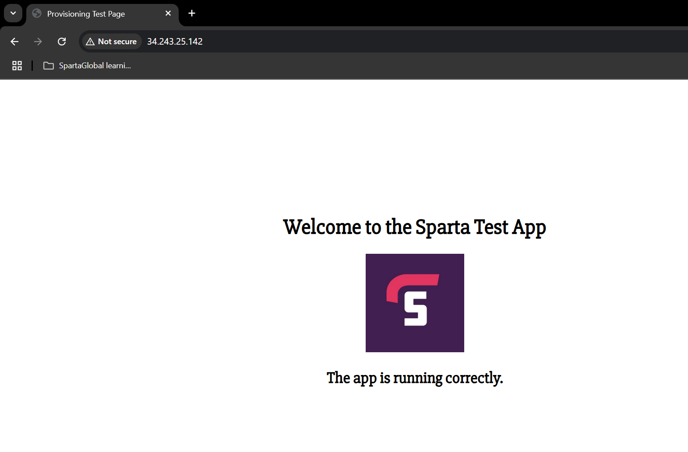
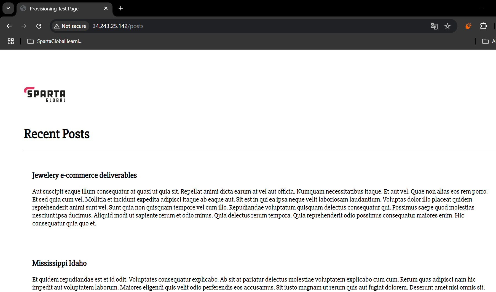

# Use scripting and User Data for 2-Tier App Deployment

- [Use scripting and User Data for 2-Tier App Deployment](#use-scripting-and-user-data-for-2-tier-app-deployment)
  - [Problem Statement](#problem-statement)
  - [Automation Workflow](#automation-workflow)
  - [Steps](#steps)
    - [Create VMs on AWS Console](#create-vms-on-aws-console)
      - [DB VM](#db-vm)
      - [App VM](#app-vm)
    - [Create Bash Script to provision database VM](#create-bash-script-to-provision-database-vm)
    - [Create Bash Script to provision app VM](#create-bash-script-to-provision-app-vm)
    - [Create image from the working app and db instances](#create-image-from-the-working-app-and-db-instances)
    - [Test the images](#test-the-images)
      - [Create DB instance](#create-db-instance)
      - [Create App instance](#create-app-instance)
  - [Overall Benefits to the project](#overall-benefits-to-the-project)
  - [Future Improvements](#future-improvements)

## Problem Statement

- Nodejs v20 web application (client) in one VM, MongoDB backend in another VM. 2-tier architecture.
- Initial deployment done manually i.e. ssh in, install dependencies and app folder etc. Not only time consuming, but prone to human error.
- Goal is to automate the deployment as per the workflow below i.e. scripting -> user data -> generalised image + user data. Bonus points for complete automation using Terraform.
- check to confirm homepage and /posts page runs successfully.
- solution should be idempotent e.g. run without issue multiple times.

## Automation Workflow


## Steps

### Create VMs on AWS Console

#### DB VM

- VPC: default
- Subnet: default
- AMI: Ubuntu 22.04 LTS (HVM), SSD
- Instance type: t3.micro
- Key pair: tech501-sameem-aws-key
- NSG: Allow SSH & MongoDB (27017) any

#### App VM

- VPC: default
- Subnet: default
- AMI: Ubuntu 22.04 LTS (HVM), SSD
- Instance type: t3.micro
- Key pair: tech501-sameem-aws-key
- NSG: Allow SSH & HTTP any

### Create Bash Script to provision database VM

```bash
#!/bin/bash
# This script will deploy a MongoDB database on an Ubuntu 22.04 server

# Exit script if error occurs
set -e

# Set debconf to non-interactive mode to bypass prompts
export DEBIAN_FRONTEND=noninteractive

# Redirect all output and errors to a log file
exec > /var/log/prov-db.log 2>&1

# Update package list and install
echo "updating package list and upgrading packages..."
sudo apt update && sudo apt upgrade -y

# Install gnupg and curl
echo "installing gnupg and curl..."
sudo apt install gnupg curl -y

# Import the MongoDB public GPG key if not already imported
if ! sudo gpg --list-keys | grep -q "MongoDB 7.0 Release Signing Key"; then
  echo "importing the MongoDB public GPG key..."
  curl -fsSL https://www.mongodb.org/static/pgp/server-7.0.asc | \
     sudo gpg -o /usr/share/keyrings/mongodb-server-7.0.gpg \
     --dearmor
else
  echo "MongoDB public GPG key already imported."
fi

# Create the list file /etc/apt/sources.list.d/mongodb-org-7.0.list if not already created
if [ ! -f /etc/apt/sources.list.d/mongodb-org-7.0.list ]; then
  echo "creating the list file for MongoDB..."
  echo "deb [ arch=amd64,arm64 signed-by=/usr/share/keyrings/mongodb-server-7.0.gpg ] https://repo.mongodb.org/apt/ubuntu jammy/mongodb-org/7.0 multiverse" | sudo tee /etc/apt/sources.list.d/mongodb-org-7.0.list
else
  echo "MongoDB list file already exists."
fi

# Reload apt package database.
echo "reloading apt package database..."
sudo apt update

# install mongo db components
echo "installing MongoDB components..."
sudo apt-get install -y mongodb-org=7.0.6 mongodb-org-database=7.0.6 mongodb-org-server=7.0.6 mongodb-mongosh mongodb-org-mongos=7.0.6 mongodb-org-tools=7.0.6

# enable and start mongodb service
echo "enabling and starting MongoDB service..."
sudo systemctl enable mongod
sudo systemctl start mongod

# Change the bindIp in the mongod.conf file if not already changed
if ! grep -q "bindIp: 0.0.0.0" /etc/mongod.conf; then
  echo "changing the bindIp in the mongod.conf file..."
  sudo sed -i 's/127.0.0.1/0.0.0.0/' /etc/mongod.conf
else
  echo "bindIp already set to 0.0.0.0 in mongod.conf."
fi

# restart the mongo db service
echo "restarting MongoDB service..."
sleep 5
sudo systemctl restart mongod

# Check if all commands were successful
if [ $? -eq 0 ]; then
  echo "Deployment successful!"
else
  echo "Deployment failed!"
  exit 1
fi
```

- can ssh into the db to check script is running.
- run script again to test idempotency.

```bash
sudo systemctl status mongod
```

### Create Bash Script to provision app VM

```bash
#!/bin/bash
# This script deploys a Node.js app on Ubuntu 22.04

# Exit script if error occurs
set -e

# Set debconf to non-interactive mode to bypass prompts
export DEBIAN_FRONTEND=noninteractive

# Log all output (both stdout & stderr) to a log file and display in terminal
exec > >(tee -a /var/log/prov-app.log) 2>&1

echo "🔄 Updating package list and upgrading packages..."
sudo apt update && sudo apt upgrade -y

echo "🌐 Installing Nginx..."
sudo apt install -y nginx

# Enable & Start Nginx if not already running
if ! systemctl is-active --quiet nginx; then
  echo "✅ Enabling & starting Nginx..."
  sudo systemctl enable nginx
  sudo systemctl start nginx
else
  echo "✅ Nginx is already running."
fi

echo "📦 Installing Node.js & npm..."
sudo bash -c "curl -fsSL https://deb.nodesource.com/setup_20.x | bash -"
sudo apt-get install -y nodejs git

echo "⚙️ Installing PM2..."
if ! command -v pm2 &> /dev/null; then
  sudo npm install -g pm2
else
  echo "✅ PM2 is already installed."
fi

echo "📂 Checking for Node.js app repo..."
APP_DIR="/home/ubuntu/tech501-sparta-app"

if [ -d "$APP_DIR" ]; then
  echo "🔄 Repo exists, pulling latest changes..."
  cd "$APP_DIR"
  git reset --hard
  git pull
else
  echo "📥 Cloning the Node.js app repo..."
  git clone https://github.com/sameem97/tech501-sparta-app.git "$APP_DIR"
fi

echo "🛠️ Configuring Nginx Reverse Proxy..."
NGINX_CONF="/etc/nginx/sites-available/default"
if ! grep -q "proxy_pass http://127.0.0.1:3000;" "$NGINX_CONF"; then
  sudo sed -i 's|try_files.*|proxy_pass http://127.0.0.1:3000;|' "$NGINX_CONF"
else
  echo "✅ Nginx reverse proxy already configured."
fi

echo "🔄 Restarting Nginx to apply changes..."
sudo systemctl restart nginx

echo "🗄️ Setting up MongoDB connection..."
export DB_HOST="mongodb://<db_private_ip>:27017/posts"

echo "📂 Changing directory to app..."
cd "$APP_DIR/app"

echo "📦 Installing npm dependencies..."
npm install

# Set HOME variable for PM2
export HOME=/home/ubuntu

echo "🚀 Starting Node.js app with PM2..."
if pm2 describe app > /dev/null 2>&1; then
  echo "🔄 Restarting existing app..."
  pm2 restart app --update-env
else
  echo "✅ Starting new instance of the app..."
  pm2 start app.js --name app --env production --update-env
fi

# Ensure PM2 auto-starts on reboot
sudo pm2 startup systemd -u ubuntu --hp /home/ubuntu
pm2 save

echo "🎉 Deployment successful!"
```

- test homepage and /posts page is showing.
- test idempotency by running again.





### Create image from the working app and db instances

- on instance page, go to `Actions`, `Image and templates`, `Create Image`.

### Test the images

#### Create DB instance

- create db instance from the db image.
- test as before to ensure mongodb is up and running upon deployment.

#### Create App instance

- create app instance from app image.
- provide `user data` as below.

```bash
#!/bin/bash
# the script below will be used to initialise the app vm via User Data

# Log all output (both stdout & stderr) to a log file and display in terminal
exec > >(tee -a /var/log/prov-app.log) 2>&1

# navigating into app folder
cd /home/ubuntu/tech501-sparta-app
cd app

#export DB_HOST= correct private IP
export DB_HOST=mongodb://<db_private_ip>:27017/posts

# start the app in the background
pm2 start app.js
```

- test as before to ensure homepage and /posts page is showing.

## Overall Benefits to the project

- much faster to deploy with custom image and small bit of user data.
- less room for human error.

## Future Improvements

- Use Terraform to provision and manage the EC2 instances. Can specify User Data and AMI.
- In other words, single `terraform apply` command can get app and db running. No need to create VM in AWS console.
