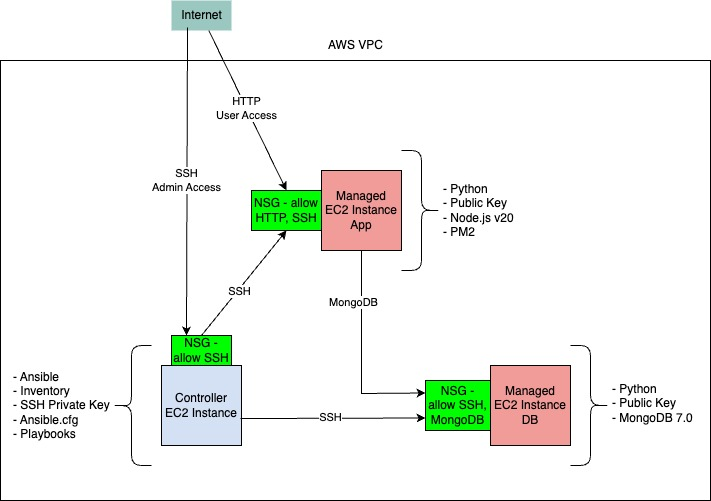
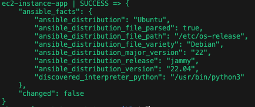
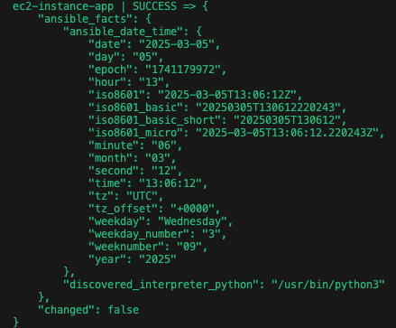
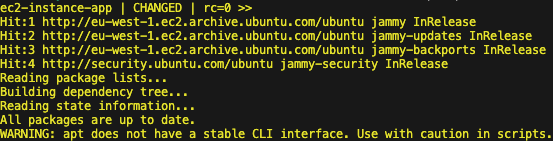
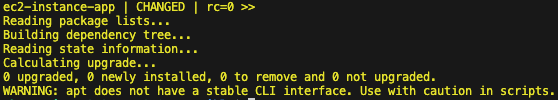
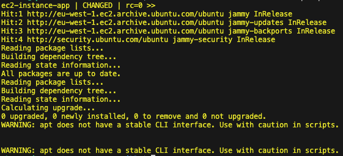
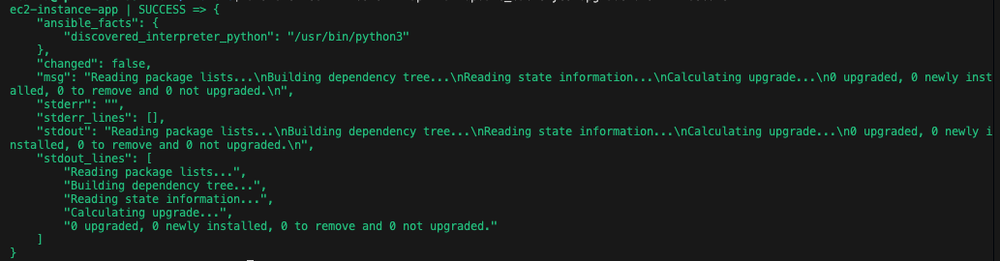
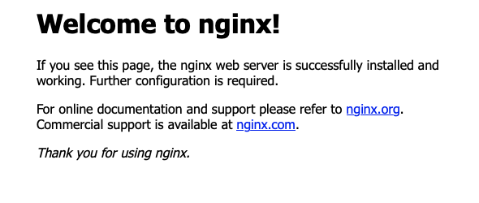

# Ansible

- [Ansible](#ansible)
  - [Fundamentals](#fundamentals)
    - [IaC vs Configuration Management](#iac-vs-configuration-management)
    - [Provisioning Infrastructure with CM tools](#provisioning-infrastructure-with-cm-tools)
    - [What is Ansible and how does it work?](#what-is-ansible-and-how-does-it-work)
    - [Alternatives to Ansible](#alternatives-to-ansible)
      - [Puppet](#puppet)
        - [Overview](#overview)
        - [Features](#features)
        - [Pros \& Cons](#pros--cons)
        - [Use Case](#use-case)
      - [Chef](#chef)
        - [Overview](#overview-1)
        - [Features](#features-1)
        - [Pros \& Cons](#pros--cons-1)
        - [Use Case](#use-case-1)
      - [SaltStack (Salt)](#saltstack-salt)
        - [Overview](#overview-2)
        - [Features](#features-2)
        - [Pros \& Cons](#pros--cons-2)
        - [Use Case](#use-case-2)
      - [Terraform](#terraform)
        - [Overview](#overview-3)
        - [Features](#features-3)
        - [Pros \& Cons](#pros--cons-3)
        - [Use Case](#use-case-3)
      - [Rudder](#rudder)
        - [Overview](#overview-4)
        - [Features](#features-4)
        - [Pros \& Cons](#pros--cons-4)
        - [Use Case](#use-case-4)
      - [Choosing the Right Tool](#choosing-the-right-tool)
        - [Key Takeaways](#key-takeaways)
    - [Major industry leaders using IaC and CM tools](#major-industry-leaders-using-iac-and-cm-tools)
  - [Architecture](#architecture)
  - [Setup on Ubuntu](#setup-on-ubuntu)
    - [Installation](#installation)
    - [Configure SSH access for Ansible](#configure-ssh-access-for-ansible)
  - [Ansible Inventory](#ansible-inventory)
    - [Variable Assignment to Groups](#variable-assignment-to-groups)
  - [Configuration](#configuration)
  - [Ad Hoc Commands](#ad-hoc-commands)
    - [Ping Module](#ping-module)
    - [Command Module](#command-module)
    - [Copy Module](#copy-module)
    - [File Module](#file-module)
    - [Setup Module](#setup-module)
  - [Playbooks](#playbooks)
  - [Tasks](#tasks)
    - [Create EC2 instances for Ansible controller and app managed node](#create-ec2-instances-for-ansible-controller-and-app-managed-node)
    - [Setup dependencies for the Ansible controller and app node](#setup-dependencies-for-the-ansible-controller-and-app-node)
    - [Use ad hoc commands](#use-ad-hoc-commands)
      - [Test connectivity](#test-connectivity)
      - [Get OS](#get-os)
      - [Get date](#get-date)
      - [Update and Upgrade packages](#update-and-upgrade-packages)
        - [Command Module](#command-module-1)
        - [Shell Module](#shell-module)
        - [APT module](#apt-module)
      - [Copy test file](#copy-test-file)
    - [Create and run playbook to install nginx on target node](#create-and-run-playbook-to-install-nginx-on-target-node)
    - [Create and run playbook to provision app VM](#create-and-run-playbook-to-provision-app-vm)
    - [NPM Start](#npm-start)
      - [PM2](#pm2)
    - [Create and run playbook to print facts gathered](#create-and-run-playbook-to-print-facts-gathered)
    - [Create EC2 instance for db managed node](#create-ec2-instance-for-db-managed-node)
    - [Create and run playbook to update and upgrade web and db groups of machines](#create-and-run-playbook-to-update-and-upgrade-web-and-db-groups-of-machines)
    - [Create and run playbook to install mongodb](#create-and-run-playbook-to-install-mongodb)
    - [Create and run playbooks to provision the app and database](#create-and-run-playbooks-to-provision-the-app-and-database)
  - [Challenges](#challenges)
  - [What I learnt from this project](#what-i-learnt-from-this-project)
  - [Benefits I have seen from this project](#benefits-i-have-seen-from-this-project)

## Fundamentals

### IaC vs Configuration Management

- Ansible falls under configuration management (CM) tool
- IaC is the practise of managing and provisioning infrastructure using code and automation instead of manual processes e.g. Terraform.
- CM focuses on installing, configuring and managing software and system settings on existing infrastructure.
- Whilst infrastructure can be provisioned with CM tools, it is not their primary purpose.

### Provisioning Infrastructure with CM tools

- possible with some CM tools e.g. Ansible using `cloud modules`, but not as powerful as terraform for complex infrastructure provisioning. Lacks built-in state management.

### What is Ansible and how does it work?

- Open-source automation tool
- Can run anywhere
- Automate virtually any task
- Built on Python
- Uses human-readable scripts called playbooks (yaml) to automate the task
- Define declarative state in the playbook i.e. what you want the system to look like. Ansible ensures it remains in that state.

- principles:
  - **agent-less architecture**: no need to install ansible on managed nodes
  - **simplicity**: simple yaml syntax for playbooks. Decentralised, can use SSH with existing keys for authentication.
  - **scalability and flexibility**: modular design allows easy and quick scaling. Support range of operating systems, cloud platforms and network devices.
  - **idempotency and predictability**: can run playbook many times, ansible maintains desired state.

### Alternatives to Ansible

#### Puppet

##### Overview

- Developed by **Puppet, Inc.**, Puppet is a declarative configuration management tool.
- Uses a client-server (agent-master) model.
- Written in **Ruby** and uses its own domain-specific language (**Puppet DSL**).

##### Features

- **State enforcement**: Ensures system configuration is maintained.
- **Centralised control**: Uses a **Puppet Master** to manage multiple nodes.
- **Idempotent**: Runs only required changes, similar to Ansible.
- **Strong reporting & compliance management**.

##### Pros & Cons

✅ **Scalable**, best suited for large enterprises.  
✅ **Mature ecosystem** with a large number of modules.  
❌ **Steeper learning curve** due to Puppet DSL.  
❌ **Requires an agent** installed on managed nodes.  

##### Use Case

- Large-scale infrastructure automation and compliance enforcement.

---

#### Chef

##### Overview

- A configuration management tool written in **Ruby**.
- Uses a procedural approach with **Chef Recipes & Cookbooks**.
- Follows a client-server architecture.

##### Features

- **Uses Ruby-based DSL** for writing configurations.
- **Knife CLI** for managing servers.
- **Chef Server, Chef Client, and Chef Workstation** architecture.
- **Test-driven infrastructure development**.

##### Pros & Cons

✅ **Highly flexible** and customisable.  
✅ **Strong community and support**.  
❌ **More complex syntax** compared to YAML (Ansible).  
❌ **Requires an agent** to be installed.  

##### Use Case

- Best for DevOps teams requiring a **highly customisable** configuration tool.

---

#### SaltStack (Salt)

##### Overview

- Open-source configuration management and orchestration tool.
- Uses a client-server model but also supports agentless mode.
- Written in **Python**.

##### Features

- **Event-driven automation**.
- **Faster than Ansible** due to ZeroMQ messaging.
- Uses **YAML-based state files**.
- Can be **agent-based or agentless**.

##### Pros & Cons

✅ **High-speed remote execution** (faster than Ansible).  
✅ **Scales well** for large environments.  
❌ **More complex setup** than Ansible.  
❌ **Requires Salt Master and Minions (for agent mode)**.  

##### Use Case

- Large-scale infrastructure requiring **fast** automation and execution.

---

#### Terraform

##### Overview

- An **Infrastructure as Code (IaC)** tool developed by **HashiCorp**.
- Manages cloud infrastructure provisioning (e.g., AWS, Azure, GCP).
- Uses **HCL (HashiCorp Configuration Language)**.

##### Features

- **Declarative configuration** (similar to Ansible).
- **Works best with cloud providers**.
- **State management** with a Terraform state file.
- **Modular infrastructure deployment**.

##### Pros & Cons

✅ **Best for provisioning and infrastructure automation**.  
✅ **Strong support for cloud services**.  
❌ **Not a full configuration management tool** (unlike Ansible).  
❌ **No built-in agent for continuous enforcement**.  

##### Use Case

- Ideal for **cloud automation, infrastructure provisioning, and scaling**.

---

#### Rudder

##### Overview

- Open-source **continuous configuration and compliance** management tool.
- Uses an agent-based model.
- Web-based interface for easy management.

##### Features

- **GUI-driven configuration**.
- **Policy-based enforcement**.
- Supports **real-time monitoring**.

##### Pros & Cons

✅ **Easier learning curve** compared to Puppet or Chef.  
✅ **Built-in compliance and reporting**.  
❌ **Less popular and smaller community**.  
❌ **Requires an agent**.  

##### Use Case

- Ideal for organisations needing **compliance enforcement** and easy-to-use interfaces.

---

#### Choosing the Right Tool

| Feature          | Ansible | Puppet | Chef  | SaltStack | Terraform |
|-----------------|---------|--------|-------|-----------|-----------|
| **Agentless**   | ✅      | ❌     | ❌    | ✅ (optional) | ✅       |
| **Declarative** | ✅      | ✅     | ❌    | ✅         | ✅       |
| **Procedural**  | ❌      | ❌     | ✅    | ❌         | ❌       |
| **Cloud Support** | ✅    | ✅     | ✅    | ✅         | ✅ (Best) |
| **Ease of Use** | ✅ (YAML) | ❌ (Puppet DSL) | ❌ (Ruby DSL) | ❌ | ✅ (HCL) |
| **Speed**       | ⚡ (Fast) | Medium | Medium | ⚡⚡ (Very Fast) | Medium |

##### Key Takeaways

- **Choose Ansible** if you want **agentless, easy YAML-based automation**.
- **Choose Puppet/Chef** for **complex enterprise configurations**.
- **Choose SaltStack** if you need **speed and event-driven automation**.
- **Choose Terraform** if your focus is **cloud infrastructure provisioning**.
- **Choose Rudder** for **compliance-driven automation**.

### Major industry leaders using IaC and CM tools

## Architecture


## Setup on Ubuntu

### Installation

- Update ubuntu package lists

```bash
sudo apt update
```

- ubuntu's default repositories include ansible, so installation is simple.

```bash
sudo apt install ansible -y
```

- check ansible installation.

```bash
ansible --version
```

---

- Note, ansible is written in Python and the tasks ran on managed nodes are python scripts. In fact, installing Ansible using PIP simply installs various Python modules.
- So Python is a dependency for Ansible. On the control node, Ansible needs to be installed but on a managed node, only Python is needed as the interpreter is used to run the scripts and output results back to the control node.

---

### Configure SSH access for Ansible

- need SSH access for control node to communicate with managed nodes
- will setup SSH key-based authentication for ease and security

- generate SSH key pair

```bash
ssh-keygen -t rsa -b 4096 -C "email@example.com"
```

- then need to move public key to your managed node.

```bash
ssh-copy-id username@<managed_node_ip>
```

- enter user's password when prompted.
- this will move the public key to the authorised keys directory on the system so the ansible controller can authenticate with it via SSH.

- confirm ssh access into the managed node. No need to specify private key, will automatically pick it up if in default location.

```bash
ssh username@<managed_node_ip>
```

## Ansible Inventory

- this file defines the hosts and groups of hosts upon which commands, modules and tasks in a playbook operate.
- tells ansible what machines it can connect to.
- this `hosts` file should be created in `/etc/ansible/` directory.
- example setup below where both control node and managed node are on the same local machine.

```ansible
[local]
localhost ansible_connection=local

[webservers]
web1 ansible_host=localhost ansible_connection=ssh ansible_user=<username>
```

- defines two groups, `local` and `webservers`
- `localhost ansible_connection=local` tells ansible to connect to the local machine directly, without using SSH.
- `web1 ansible_host=localhost ansible_connection=ssh ansible_user=<username>` defines host called web1, also connecting to localhost but using ssh and logging in as user specified.

- test connectivity to hosts.

```bash
ansible all -m ping
```

- run on `all` hosts
- `-m ping`, use ansible ping module

- should see success for both hosts. It means ansible can reach both hosts successfully.

- can use default ansible command module to check system uptime.

```bash
ansible all -a "uptime"
```

- `CHANGED` means the uptime command ran successfully on the host. Can see output as shown.

### Variable Assignment to Groups

- Can assign variables to groups in inventory file. Can use these variables in playbooks and templates, making the ansible code flexible and reusable.

- example:

```ansible
[webservers]
localhost ansible_connection=local

[production:children]
webservers

[webservers:vars]
http_port=80
```

- assigns variable http_port with value 80 to all hosts in webservers group.
- `:vars` suffix is used to define variables for a group.
- can reference this variable in e.g. a yml playbook using the `{{ http_port }}` syntax.

## Configuration

- check if any system wide config file

```bash
cat /etc/ansible/ansible.cfg
```

- check ansible default configuration values.

```bash
ansible-config dump
```

- create custom `ansible.cfg` config file e.g.

```ansible
[defaults]
inventory = <full_inventory_file_path>
remote_user = <username>
host_key_checking = False
stdout_callback = yaml

[privilege_escalation]
become = True
become_method = sudo
become_user = <privilege_username>
become_ask_pass = False
```

- check if ansible is using new custom config

```bash
ansible-config dump --only-changed
```

- should see the config as defined in `ansible.cfg`.

## Ad Hoc Commands

- quick one-off tasks you can run without the need for a full playbook
- e.g. check system status, manage files, execute quick commands across multiple servers.

- general structure:

```bash
ansible <pattern> -m <module> -a "<module options>"
```

- `pattern` is the host or group of hosts from your inventory that you want to target.
- `-m module` specifies which ansible module to use
- `-a "<module optiona>"` provides arguments to the module.

### Ping Module

- ping is an example of an ad hoc command.
- ping all hosts in the `inventory` file

```bash
ansible all -i inventory -m ping
```

### Command Module

- common module used to run arbitrary commands on target hosts
- e.g. check disk space for all hosts

```bash
ansible all -i inventory -m command -a "df -h"
```

- e.g. check uptime for webservers group

```bash
ansible webservers -i inventory -m command -a "uptime"
```

- if you don't specify a module, will use default command module.
- so can omit the -m command.
- e.g. show memory usage for dbservers group

```bash
ansible dbservers -i inventory -a "free -m"
```

- note, command module doesn't support shell variables or operations like `|, <, >, &` etc. Need to use shell module for that.

### Copy Module

- used to copy files from the local machine to the remote hosts
- e.g. create a simple file and copy it to all hosts (/tmp directory)

```bash
echo "Hello from Ansible" > hello.txt
ansible all -i inventory -m copy -a "src=hello.txt dest=/tmp/hello.txt"
```

### File Module

- used to manage files and directories
- e.g. create a directory on all webservers

```bash
ansible webservers -i inventory -m file -a "path=/tmp/test_dir state=directory mode=0755"
```

- creates a directory named test_dir in the /tmp directory on all webservers, with permissions set to 0755.

### Setup Module

- used to gather facts about the remote hosts
- automatically run at the beginning of playbooks, but can also be used in ad-hoc commands

```bash
ansible dbservers -i inventory -m setup
```

- will display a large amount of information about the hosts in dbservers group.
- can use filters to limit the output

```bash
ansible dbservers -i inventory -m setup -a "filter=ansible_distribution*"
```

- will only show facts related to the OS distribution.

## Playbooks

...

## Tasks

- The tasks described below will build up to deploy our two-tier app using Ansible.

- Target architecture:



- note, there will be some miscallaneous tasks below for learning purposes rather than for the app deployment.

### Create EC2 instances for Ansible controller and app managed node

- Controller:
  - name: tech501-sameem-ubuntu-2204-ansible-controller
  - size: t3.micro
  - nsg: allow SSH
  - key pair: use existing
  - image: ubuntu server 22.04 LTS

- Managed node (app):
  - name: tech501-sameem-ubuntu-2204-ansible-target-node-app
  - size: t3.micro
  - nsg: allow SSH, HTTP
  - key pair: use existing
  - image: ubuntu server 22.04 LTS

- above created via AWS console.
- confirmed SSH access from my local machine.

### Setup dependencies for the Ansible controller and app node

- Controller:
  - SSH in.
  - Install Ansible
  - Add private key to access managed nodes. Set read-only access.
  - Create ansible folder with 3 files:
    - ansible.cfg
    - inventory
    - roles

ansible.cfg:

```ansible
[defaults]
inventory = <inventory_file_path>
remote_user = <remote_username>
host_key_checking = <host_key_checking>
stdout_callback = yaml

[privilege_escalation]
become = <become>
become_method = <become_method>
become_user = <privileged_username>
become_ask_pass = <become_ask_pass>
```

inventory:

```ansible
[web]
ec2-instance-app ansible_host=<app_private_ip> ansible_connection=ssh ansible_ssh_private_key_file=<private_key_path>
```

### Use ad hoc commands

#### Test connectivity

- use ping module to test connectivity to all hosts in web group:

```bash
ansible web -i inventory -m ping
```

- should give `SUCCESS` output.

#### Get OS

- let's try getting the OS via the setup module.

```bash
ansible web -i inventory -m setup -a "filter=ansible_distribution*"
```



- as seen in the output above, can use the setup module with the specified filter to retrieve the linux distribution details for the machines in the web group.
- note, `*` is wildcard character so will return facts beginning with `ansible_distribution` (see above).
- can also use `grep` rather than filter function.

#### Get date

- use setup module once again as we want to obtain a `fact` about the managed nodes.

```bash
ansible web -i inventory -m setup -a "filter=ansible_date*"
```



- note, can play around with the filters by seeing all facts (json output) and exploring what details we need extracting.
- can also comma separate filters to apply multiple filters.

#### Update and Upgrade packages

##### Command Module

- need to run update and upgrade commands separately as command module does not support use of shell operators e.g. && so would run `apt update && apt upgrade -y` as a single command i.e. providing arguments to `apt update`

- apt update:

```bash
ansible web -i inventory -a "apt update" --become
```



- apt upgrade:

```bash
ansible web -i inventory -a "apt upgrade -y" --become
```



##### Shell Module

- recommended to use shell module rather than command module for running shell commands

```bash
ansible web -i inventory -m shell -a "apt update && apt upgrade -y" --become
```



##### APT module

```bash
ansible web -i inventory -m apt -a "update_cache=yes upgrade=dist" --become
```

- `-a "update_cache=yes upgrade=dist"` equivalent to `sudo apt update && sudo apt upgrade -y`
- `--become` needed to run the command with sudo since root access is required to update packages

- output as below:



- as visible, my packages are already up to date.

#### Copy test file

- create test_file.txt
- use copy module:

```bash
ansible web -i inventory -m copy -a "src=/home/ubuntu/ansible/test_file.txt dest=/home/ubuntu/test_file.txt mode=0400"
```

- note, recommended to use full file paths vs relative.
- can set permissions with `mode` in this case owner read only.
- confirm file has been transferred on the managed node.

### Create and run playbook to install nginx on target node

- create playbook: `install_nginx.yml`

```yml
---
- name: install nginx play
  hosts: web
  become: true
  tasks:
    - name: get package facts
      package_facts:
        manager: auto

    - name: update apt package index
      apt:
        update_cache: yes
        cache_valid_time: 3600

    - name: install nginx package
      apt:
        name: nginx
        state: present
      register: nginx_install

    - name: ensure nginx service is enabled and started
      service:
        name: nginx
        state: started
        enabled: yes
      register: nginx_service

    - name: collect nginx service facts
      service_facts:

    - name: check if nginx configuration exists
      stat:
        path: /etc/nginx/nginx.conf
      register: nginx_conf

    - name: display nginx information
      debug:
        msg:
          - "Nginx installed: {{ 'Yes' if 'nginx' in ansible_facts.packages else 'No' }}"
          - "Nginx version: {{ ansible_facts.packages['nginx'][0].version if 'nginx' in ansible_facts.packages else 'Not installed' }}"
          - "Nginx service status: {{ 'Active' if ansible_facts.services['nginx.service'].state == 'running' else 'Not running' }}"
          - "Nginx configuration exists: {{ nginx_conf.stat.exists }}"
          - "Installation changed: {{ nginx_install.changed }}"
          - "Service status changed: {{ nginx_service.changed }}"
```

- run playbook:

```bash
ansible-playbook -i inventory install_nginx.yml
```

- check output messages.
- confirm nginx loads up when you visit managed node (app) public IP:



### Create and run playbook to provision app VM

### NPM Start

- create playbook: `prov_app_with_npm_start.yml`

```ansible
---
- name: Install app dependencies and run app with npm start
  hosts: web
  become: true

  tasks:

    - name: Add NodeSource repository for Node.js 20.x
      shell: curl -fsSL https://deb.nodesource.com/setup_20.x | bash -
      args:
        executable: /bin/bash
        creates: /etc/apt/sources.list.d/nodesource.list  # Ensures NodeSource repo exists

    - name: Upgrade all system packages
      apt:
        update_cache: yes
        upgrade: dist

    - name: Install Node.js
      apt:
        name: nodejs
        state: present

    - name: Remove app if already existing
      file:
        path: "/home/ubuntu/tech501-sparta-app"
        state: absent # ensures the path is absent

    - name: Clone or update repository
      git:
        repo: "https://github.com/sameem97/tech501-sparta-app.git"
        dest: "/home/ubuntu/tech501-sparta-app"
        version: "main"
        force: yes

    - name: Install npm dependencies
      command: npm install --loglevel verbose
      args:
        chdir: "/home/ubuntu/tech501-sparta-app/app"

    - name: Stop any running Node.js application
      shell: sudo pkill -9 -f 'node'
      ignore_errors: yes

    - name: Start the Node.js application
      shell: "exec nohup npm start > app.log 2>&1 &"
      args:
        chdir: "/home/ubuntu/tech501-sparta-app/app"
```

- run playbook
- check output messages
- confirm app homepage loads up when you visit app public IP port 3000.


#### PM2

- use pm2 node.js process manager to run app in the background
- create playbook: `prov_app_with_pm2.yml`

```ansible
---
- name: Install app dependencies and run app with pm2
  hosts: web
  become: true

  tasks:

    - name: Add NodeSource repository for Node.js 20.x
      shell: curl -fsSL https://deb.nodesource.com/setup_20.x | bash -
      args:
        executable: /bin/bash
        creates: /etc/apt/sources.list.d/nodesource.list  # Ensures NodeSource repo exists

    - name: Upgrade all system packages
      apt:
        update_cache: yes
        upgrade: dist

    - name: Install Node.js
      apt:
        name: nodejs
        state: present

    - name: Install pm2 globally
      npm:
        name: pm2
        global: yes
        state: present

    - name: Remove app if already existing
      file:
        path: "/home/ubuntu/tech501-sparta-app"
        state: absent # ensures the path is absent

    - name: Clone or update repository
      git:
        repo: "https://github.com/sameem97/tech501-sparta-app.git"
        dest: "/home/ubuntu/tech501-sparta-app"
        version: "main"
        force: yes

    - name: Install npm dependencies
      command: npm install --loglevel verbose
      args:
        chdir: "/home/ubuntu/tech501-sparta-app/app"

    - name: Stop any running Node.js application
      shell: pm2 delete app || true
      ignore_errors: yes

    - name: Start the Node.js application
      shell: pm2 start app.js --name app --env production --update-env
      args:
        chdir: "/home/ubuntu/tech501-sparta-app/app"

    - name: Ensure PM2 auto-starts on reboot for user 'ubuntu'
      command: pm2 startup systemd -u ubuntu --hp /home/ubuntu
      args:
        creates: /etc/systemd/system/pm2-ubuntu.service  # only run if systemd service not already defined

    - name: Save pm2 process list
      command: pm2 save
```

### Create and run playbook to print facts gathered

- facts - everything the controller knows about the remote host e.g. OS, IP addresses, attached filesystems etc

```ansible
---
- name: Print facts on all hosts
  hosts: all
  gather_facts: yes

  tasks:
    - name: Print gathered facts on all hosts
      debug:
        var: ansible_facts
```

- run playbook
- output should be long list of facts, some nested.
- facts can be used e.g. in debug msg for outputting during playbook run.
- can also be referenced as inputs for modules.

### Create EC2 instance for db managed node

- Managed node (db):
  - name: tech501-sameem-ubuntu-2204-ansible-target-node-db
  - size: t3.micro
  - nsg: allow SSH, mongodb
  - key pair: use existing
  - image: ubuntu server 22.04 LTS

- as previously, ensure we update hosts file on the controller with the db node, and add the public key to the db instance.
- ensure controller can ping both app and db instances.

### Create and run playbook to update and upgrade web and db groups of machines

- create playbook: `update_upgrade_all.yml`

```ansible
---
- name: Update and upgrade all db and web hosts
  hosts:
    - web
    - db
  become: true

  tasks:
    - name: Update apt cache
      apt:
        update_cache: yes
        cache_valid_time: 3600  # one hour in seconds, so it will run update after one hour

    - name: Upgrade all packages
      apt:
        upgrade: dist  # upgrades everything on the distro
```

- best practise to separate this playbook from app deployment playbook as it minimises risks and ensures a stable deployment.

### Create and run playbook to install mongodb

- create playbook: `install_mongodb.yml`

```ansible
---
- name: install mongodb version 7.0
  hosts:
    - db
  become: true

  tasks:
    - name: install gnupg and curl
      apt:
        name:
          - gnupg
          - curl
        state: present
        update_cache: yes

    - name: download mongodb public gpg key (ASCII format)
      get_url:
        url: https://www.mongodb.org/static/pgp/server-7.0.asc
        dest: /tmp/mongodb-server-7.0.asc
        mode: '0644'
        force: no # only download key if it doesn't exist

    - name: use dearmor to convert MongoDB gpg key to binary format
      command: gpg --batch --yes --dearmor -o /usr/share/keyrings/mongodb-server-7.0.gpg /tmp/mongodb-server-7.0.asc

    - name: Set correct permissions for MongoDB GPG key
      file:
        path: /usr/share/keyrings/mongodb-server-7.0.gpg
        mode: '0644'
        owner: root
        group: root

    - name: Remove temporary MongoDB ASCII key file
      file:
        path: /tmp/mongodb-server-7.0.asc
        state: absent

    - name: add mongodb repository to ubuntu package sources
      apt_repository:
        repo: "deb [signed-by=/usr/share/keyrings/mongodb-server-7.0.gpg] https://repo.mongodb.org/apt/ubuntu jammy/mongodb-org/7.0 multiverse" 
        state: present
        filename: mongodb-org

    - name: reload apt package database
      apt:
        update_cache: yes
      changed_when: false

    - name: install mongodb 7.0
      apt:
        name:
          - mongodb-org=7.0.6
          - mongodb-org-database=7.0.6
          - mongodb-org-server=7.0.6
          - mongodb-mongosh
          - mongodb-org-mongos=7.0.6
          - mongodb-org-tools=7.0.6
        state: present
```

- ensure mongod service is running:

```bash
sudo systemctl status mongod
```

### Create and run playbooks to provision the app and database

- create `prov_db.yml`
- base will be same as `install_mongodb.yml` (see previous task).
- need to add tasks to enable mongodb, change bindIp and restart service.

```ansible
---
- name: provision mongodb version 7.0 play
  hosts:
    - db
  become: true

  tasks:

    - name: install gnupg and curl
      apt:
        name:
          - gnupg
          - curl
        state: present
        update_cache: yes

    - name: download mongodb public gpg key (ASCII format)
      get_url:
        url: https://www.mongodb.org/static/pgp/server-7.0.asc
        dest: /tmp/mongodb-server-7.0.asc
        mode: '0644'
        force: no # only download key if it doesn't exist

    - name: use dearmor to convert MongoDB gpg key to binary format
      command: gpg --batch --yes --dearmor -o /usr/share/keyrings/mongodb-server-7.0.gpg /tmp/mongodb-server-7.0.asc

    - name: Set correct permissions for MongoDB GPG key
      file:
        path: /usr/share/keyrings/mongodb-server-7.0.gpg
        mode: '0644'
        owner: root
        group: root

    - name: Remove temporary MongoDB ASCII key file
      file:
        path: /tmp/mongodb-server-7.0.asc
        state: absent

    - name: add mongodb repository to ubuntu package sources
      apt_repository:
        repo: "deb [signed-by=/usr/share/keyrings/mongodb-server-7.0.gpg] https://repo.mongodb.org/apt/ubuntu jammy/mongodb-org/7.0 multiverse" 
        state: present
        filename: mongodb-org

    - name: reload apt package database
      apt:
        update_cache: yes
      changed_when: false

    - name: install mongodb 7.0
      apt:
        name:
          - mongodb-org=7.0.6
          - mongodb-org-database=7.0.6
          - mongodb-org-server=7.0.6
          - mongodb-mongosh
          - mongodb-org-mongos=7.0.6
          - mongodb-org-tools=7.0.6
        state: present

    - name: enable and start mongodb service
      service:
        name: mongod
        state: started
        enabled: yes

    - name: Change MongoDB bind IP to allow remote connections
      lineinfile:
        path: /etc/mongod.conf
        regexp: '^\s*bindIp:\s*127.0.0.1'  # Regex to match the existing line
        line: '  bindIp: 0.0.0.0'  # New line content
        backrefs: yes
      register: bindip_config

    - name: Restart mongodb service
      service:
        name: mongod
        state: restarted
      when: bindip_config.changed # only restarts if the bindIp change was made
```

- run the playbook
- run adhoc commands to check status of mongodb and bindIp config.
- confirm mongodb is running:

```bash
ansible db -i inventory -a "systemctl status mongod" --become
```

- confirm bindIp has changed:

```bash
ansible db -i inventory -a "cat /etc/mongod.conf" --become
```

- create temporary `DB_HOST` environment variable on the app host:

```bash
export DB_HOST=mongodb://<db_private_ip>:27017/posts
```

- combine `provision mongodb version 7.0 play` and `provision node.js v20 app play` into single playbook titled: `prov_app_all.yml`.
- need to add tasks to app play:
  - set up mongodb connection string
  - bonus: install nginx and get reverse proxy working

`prov_app_all.yml`:

```ansible
---
- name: provision mongodb version 7.0 play
  hosts:
    - db
  become: true

  tasks:

    - name: install gnupg and curl
      apt:
        name:
          - gnupg
          - curl
        state: present
        update_cache: yes

    - name: download mongodb public gpg key (ASCII format)
      get_url:
        url: https://www.mongodb.org/static/pgp/server-7.0.asc
        dest: /tmp/mongodb-server-7.0.asc
        mode: '0644'
        force: no # only download key if it doesn't exist

    - name: use dearmor to convert MongoDB gpg key to binary format
      command: gpg --batch --yes --dearmor -o /usr/share/keyrings/mongodb-server-7.0.gpg /tmp/mongodb-server-7.0.asc

    - name: Set correct permissions for MongoDB GPG key
      file:
        path: /usr/share/keyrings/mongodb-server-7.0.gpg
        mode: '0644'
        owner: root
        group: root

    - name: Remove temporary MongoDB ASCII key file
      file:
        path: /tmp/mongodb-server-7.0.asc
        state: absent

    - name: add mongodb repository to ubuntu package sources
      apt_repository:
        repo: "deb [signed-by=/usr/share/keyrings/mongodb-server-7.0.gpg] https://repo.mongodb.org/apt/ubuntu jammy/mongodb-org/7.0 multiverse" 
        state: present
        filename: mongodb-org

    - name: reload apt package database
      apt:
        update_cache: yes
      changed_when: false

    - name: install mongodb 7.0
      apt:
        name:
          - mongodb-org=7.0.6
          - mongodb-org-database=7.0.6
          - mongodb-org-server=7.0.6
          - mongodb-mongosh
          - mongodb-org-mongos=7.0.6
          - mongodb-org-tools=7.0.6
        state: present

    - name: enable and start mongodb service
      service:
        name: mongod
        state: started
        enabled: yes

    - name: Change MongoDB bind IP to allow remote connections
      lineinfile:
        path: /etc/mongod.conf
        regexp: '^\s*bindIp:\s*127.0.0.1'  # Regex to match the existing line
        line: '  bindIp: 0.0.0.0'  # New line content
        backrefs: yes
      register: bindip_config

    - name: Restart mongodb service
      service:
        name: mongod
        state: restarted
      when: bindip_config.changed # only restarts if the bindIp change was made

- name: provision node.js v20 app play
  hosts: web
  become: true

  tasks:

    - name: Add NodeSource repository for Node.js 20.x
      shell: curl -fsSL https://deb.nodesource.com/setup_20.x | bash -
      args:
        executable: /bin/bash
        creates: /etc/apt/sources.list.d/nodesource.list  # Ensures NodeSource repo exists

    - name: Upgrade all system packages
      apt:
        update_cache: yes
        upgrade: yes

    - name: install nginx
      apt:
        name: nginx
        state: present

    - name: enable and start nginx
      service:
        name: nginx
        state: started
        enabled: yes

    - name: Install Node.js
      apt:
        name: nodejs
        state: present

    - name: Install pm2 globally
      npm:
        name: pm2
        global: yes
        state: present

    - name: Remove app if already existing
      file:
        path: "/home/ubuntu/tech501-sparta-app"
        state: absent # ensures the path is absent

    - name: Clone or update repository
      git:
        repo: "https://github.com/sameem97/tech501-sparta-app.git"
        dest: "/home/ubuntu/tech501-sparta-app"
        version: "main"
        force: yes

    - name: configure nginx reverse proxy
      lineinfile:
        path: "/etc/nginx/sites-available/default"
        regexp: '^\s*try_files\s+\$uri\s+\$uri/\s+=404;'
        line: '    proxy_pass http://127.0.0.1:3000;'  # Replacing with new value        
        backup: yes
      register: nginx_config_update

    - name: restart nginx if configuration changed
      service:
        name: nginx
        state: restarted
      when: nginx_config_update.changed

    - name: set up mongodb connection string persistently
      lineinfile:
        path: /etc/environment
        line:  "DB_HOST=mongodb://{{ hostvars['ec2-instance-db']['ansible_default_ipv4']['address'] }}:27017/posts"
        create: yes

    - name: Install npm dependencies
      command: npm install --loglevel verbose
      args:
        chdir: "/home/ubuntu/tech501-sparta-app/app"

    - name: Stop any running Node.js application
      shell: pm2 delete app || true
      ignore_errors: yes

    - name: Start the Node.js application
      shell: pm2 start app.js --name app --env production --update-env
      args:
        chdir: "/home/ubuntu/tech501-sparta-app/app"

    - name: Ensure PM2 auto-starts on reboot for user 'ubuntu'
      command: pm2 startup systemd -u ubuntu --hp /home/ubuntu
      args:
        creates: /etc/systemd/system/pm2-ubuntu.service  # only run if systemd service not already defined

    - name: Save PM2 process list
      command: pm2 save
```

- test playbook runs without errors and the app and posts page work


## Challenges

- making the playbooks idempotent was challenging at times. Use of inbuilt modules vs shell commands helped mitigate this.
- navigating ansible documentation
- playbook syntax - need to run a linter in the future

## What I learnt from this project

- how ansible works, including various ways of directing hosts e.g. ad-hoc commands vs playbooks.
- configuring ansible with ansible.cfg file
- defining our hosts in inventory file
- numerous ansible modules to complete even the most minute tasks

## Benefits I have seen from this project

- whilst ansible typically isn't used to create infrastructure, this project shows it is possible and from one playbook, we have both the app and the db running.
- ansible modules much easier to read than equivalent bash scripts I used previously
